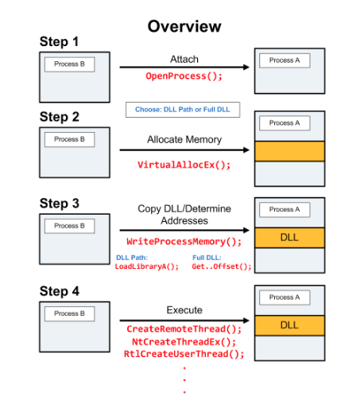

# Notes for Jul_13_2022

This is a note or a diary for the things I research in a day, this note intended for me not to forget the knowlegde I has gain (or things I has read).

## Processs Injection | How to create detection rule.

- Link: <https://redcanary.com/blog/process-injection-primer/>
- Link: <https://i.blackhat.com/USA-19/Thursday/us-19-Kotler-Process-Injection-Techniques-Gotta-Catch-Them-All-wp.pdf> (Really good paper on Process Injection)

> As far as I know writing some code into another process memory is easy, Windows provides systems API to Read and Write the memory of other processes, you need:
> - PID of the process

#### There are 3 type of process injection:
1. Spawning process
2. During Initilzation of a process
3. **During Running of a process (consider the true process injection) -> will mostly be used**

This is a Windows feature but was use by bad guys to create a way to **inject their malicous code to a legit process**, the first step to learn how to detect it to know how it works and what are the log and the resource it will create when using this technique and how hard can we detect it using SIEM and EDR

### DLL Injection | [T1055.001](https://attack.mitre.org/techniques/T1055/001)

##### Big notes: CFG/CIG-readiness: CIG prevents loading on non-Microsoft signed DLL. An attempt to do so will result r 0xC0000428 (STATUS_INVALID_IMAGE_HASH – “The hash for image %hs cannot be found in the system catalogs. The image is likely corrupt or the victim of tampering.” 

Link: <https://sec.vnpt.vn/2019/01/dll-injection/> explain very well about DLL Injection but use Vietnamese 

This picture can explain it very well, this picture I copy from the link above:

There are few key point you need to remmeber about this technique:

- It is noisy as hell 
- It is simple to do
- It is most common techniques used to inject malware into another process

> By leveraging the Sysmon we would be able to detect when any process use CreateRemoteThread() (Event ID: 8 of sysmon) that wouble give an indicator to write our detection rule

If you have a SIEM and it has correlation rule (which it will) then you write a rule that capture CreateRemoteThread() with the process id: A and process id: B

#### Hunting notes: 

Link: <https://threathunterplaybook.com/notebooks/windows/05_defense_evasion/WIN-180719170510.html> | talk really well about the threat hunting side

---
### PE Injection | [T1055.002](https://attack.mitre.org/techniques/T1055/002)

Aslo kinda similar to the DLL injection methods, using he write can be performed with native Windows API calls such as **VirtualAllocEx** and **WriteProcessMemory**, then invoked with **CreateRemoteThread** or additional code

The main benefit of this technique is that it doesn't require any shellcoding knowledge, this technique also don't need several files. the main exe self inject insdie another process and call itself in there

---
### Process Hollowing [T1055.012](https://attack.mitre.org/techniques/T1055/012)

Perharp the most anoying technique related to Process Injection, **currently sysmon has detected the Process Hollowing using Event ID 25 (Sysmon 13)**

- Link: <https://github.com/m0n0ph1/Process-Hollowing>
---
## Sysmon Logging

Really Powerful Logging Drive from sysinternal. It provides detailed information about process creations, network connections, and changes to file creation time

Some example configuration link: <https://github.com/SwiftOnSecurity/sysmon-config/blob/master/sysmonconfig-export.xml>. at the momment I haven't read or understand all the configuration in here. But in the near future I will be able to understand all of this

